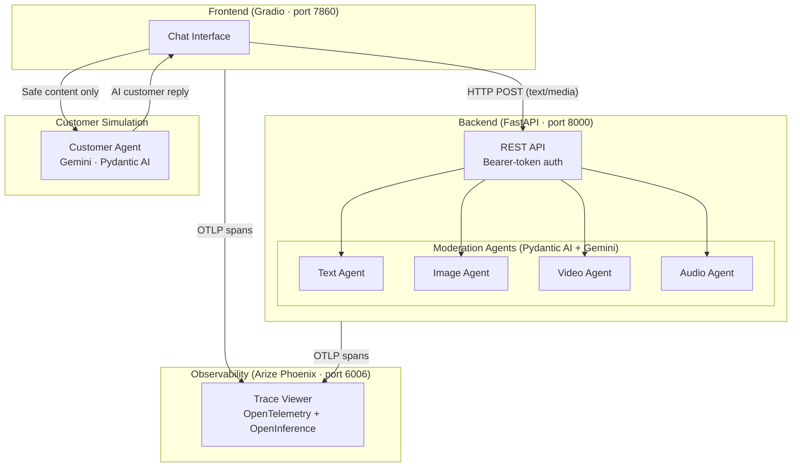

# OmniTrainer — Multimodal Customer Service Training Agent

[](https://www.python.org/)
[](https://ai.pydantic.dev/)
[](https://ai.google.dev/)
[](https://fastapi.tiangolo.com/)
[](https://gradio.app/)
[](LICENSE)

OmniTrainer is a production-grade, AI-powered **multimodal content moderation system** for customer-service training. Trainee agents practice live conversations with an LLM-simulated customer; every message and media file they send is moderated in real time before it reaches the AI customer.

---

## Architecture



**Data flow for each chat turn:**

1. Trainee types a message or uploads a file in the Gradio UI
2. Gradio sends content to the FastAPI moderation service
3. The appropriate moderation agent (text / image / video / audio) analyses it with Gemini
4. If content is flagged → blocked with feedback shown to the trainee
5. If content is safe → forwarded to the Customer Agent (Gemini), which replies as an upset customer
6. Every step emits OpenTelemetry spans visible in Arize Phoenix

---

## Features

- **Four specialised moderation agents** — text, image, video, audio — each returning structured Pydantic results with boolean flags and a natural-language rationale
- **LLM-as-a-customer simulation** — a Gemini-backed agent roleplays a frustrated ACME customer
- **Structured observability** — conversation → chat_turn → moderate_* → feedback span hierarchy in Arize Phoenix
- **REST API** — all four moderation agents exposed as authenticated FastAPI endpoints
- **Pydantic Evals** — statistical evaluation suite with LLM-judge scoring across all four modalities
- **No real API calls in tests** — `TestModel` mocking means `pytest` works without any credentials

---

## Project Layout

```
multimodal_moderation/        # Core Python package
├── agents/
│   ├── _shared.py            # Shared ACME context/role preamble
│   ├── text_agent.py
│   ├── image_agent.py
│   ├── audio_agent.py
│   ├── video_agent.py
│   └── customer_agent.py     # LLM customer simulation
├── types/
│   ├── moderation_result.py  # Pydantic output schemas
│   └── model_choice.py
├── env.py                    # Config (lazy-loaded, safe to import without credentials)
├── tracing.py                # OpenTelemetry + Arize Phoenix setup
├── utils.py                  # File-type detection
├── fastapi_app.py            # REST API
├── gradio_app.py             # Chat UI
└── app.py                    # Launcher (starts all three services)

tests/
├── conftest.py               # Dummy env vars + shared fixtures (no .env needed)
├── test_text_agent.py
├── test_image_agent.py
├── test_audio_agent.py
├── test_video_agent.py
├── test_api.py               # FastAPI endpoint tests
└── test_utils.py

evals/                        # Pydantic Evals statistical evaluation suite
├── text/  image/  audio/  video/
└── test_data/                # Sample files for evaluation

notebooks/
└── demo.ipynb                # End-to-end walkthrough

docs/
└── architecture.md           # Detailed system design
```

---

## Quick Start

### Prerequisites

- Python 3.12+
- [uv](https://docs.astral.sh/uv/) package manager
- Google Gemini API key ([get one free](https://aistudio.google.com/app/apikey))

### Installation

```bash
git clone https://github.com/your-username/omnitrainer.git
cd omnitrainer

# Install dependencies
uv sync --dev

# Install package in editable mode
uv pip install -e .
```

### Configuration

```bash
cp .env.example .env
```

Edit `.env`:

```env
GEMINI_API_KEY=your-gemini-api-key
USER_API_KEY=any-secret-you-choose        # Bearer token for the REST API
DEFAULT_GOOGLE_MODEL=gemini-2.5-flash-lite
```

### Run Tests (no credentials needed)

```bash
uv run pytest tests/ -v
```

### Start the Full Application

```bash
uv run multimodal-moderation
```

This starts:
- 🔍 **Arize Phoenix** at http://localhost:6006
- 🚀 **Moderation API** at http://localhost:8000/docs
- 💬 **Chat UI** at http://localhost:7860

---

## Running Evaluations

```bash
# Text moderation evals
uv run evals/text/test_cases.py

# Image / audio / video
uv run evals/image/test_cases.py
uv run evals/audio/test_cases.py
uv run evals/video/test_cases.py
```

Evals require a valid `GEMINI_API_KEY`. Each case is repeated `EVAL_NUM_REPEATS` times (default: 1) to measure LLM consistency.

---

## API Reference

Once the API is running, interactive docs are at **http://localhost:8000/docs**.

| Method | Endpoint | Description |
|--------|----------|-------------|
| `POST` | `/api/v1/moderate_text` | Moderate a text message |
| `POST` | `/api/v1/moderate_image_file` | Moderate an uploaded image |
| `POST` | `/api/v1/moderate_video_file` | Moderate an uploaded video |
| `POST` | `/api/v1/moderate_audio_file` | Moderate an uploaded audio file |
| `GET`  | `/api/v1/health` | Liveness probe |

All endpoints require `Authorization: Bearer <USER_API_KEY>`.

---

## Tech Stack

| Layer | Technology |
|-------|-----------|
| Agent framework | [Pydantic AI](https://ai.pydantic.dev/) |
| LLM | Google Gemini 2.5 Flash |
| REST API | FastAPI + Uvicorn |
| Chat UI | Gradio |
| Observability | OpenTelemetry + Arize Phoenix + OpenInference |
| Evaluation | Pydantic Evals |
| Package manager | uv |
| Testing | pytest + pytest-asyncio |

---

## Contributing

See [CONTRIBUTING.md](CONTRIBUTING.md) for guidelines.

## License

[MIT](LICENSE) © 2024
